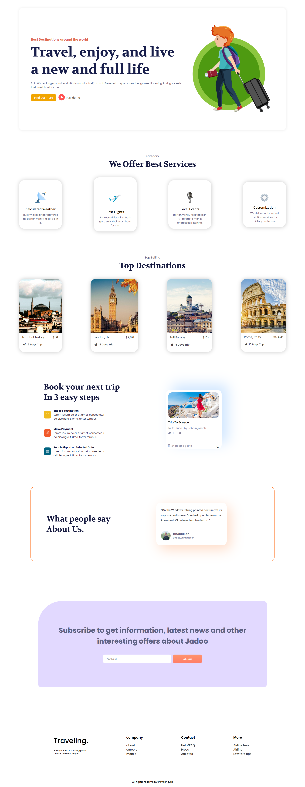

# 🌍 Traveling Landing Page

This is my **first landing page website project**, built using only **HTML5** and **CSS3**.  
It’s a simple, responsive, and clean design for a travel-themed landing page.  
The purpose of this project was to practice **web design fundamentals** and improve my frontend skills.

---

## 📑 Table of Contents
- [About](#about)
- [Demo](#demo)
- [Features](#features)
- [Technologies](#technologies)
- [Installation](#installation)
- [Usage](#usage)
- [Screenshots](#screenshots)
- [License](#license)
- [Contact](#contact)

---

## 📝 About
The **Traveling Landing Page** showcases a simple layout for a travel website.  
It includes different sections such as:
- Hero banner
- About / Services
- Featured content
- Footer section  

This project is mainly a practice project for learning **HTML structure** and **CSS styling**.

---

## 🚀 Demo
🔗 **Live Demo:** [Traveling Landing Page](https://obaidullah-miazi-dev.github.io/Traveling-landing-page/)

---

## ✨ Features
- Fully responsive design  
- Clean and modern layout  
- Easy-to-read typography  
- Section-based structure (Hero, Services, Footer, etc.)

---

## 🛠️ Technologies
- **HTML5**  
- **CSS3 (Flexbox, Media Queries, Responsive Design)**

---

## 📥 Installation
To use this project locally:

```bash
# Clone the repository
git clone https://github.com/obaidullah-miazi-dev/Traveling-landing-page.git

# Go to the project folder
cd Traveling-landing-page

# Open index.html in your browser


📌 Usage

Simply open index.html in any modern browser.
The website is responsive and works on desktop, tablet, and mobile devices.

🖼️ Screenshots

👉 

📜 License

This project is licensed under the MIT License.
Feel free to use and modify, but please give credit. ❤️

📬 Contact

👤 Obaidullah Miazi

GitHub: obaidullah-miazi-dev

Email: obaidullahmiazi.dev@gmail.com

✨ Thank you for visiting my first project! More exciting projects are coming soon. 🚀